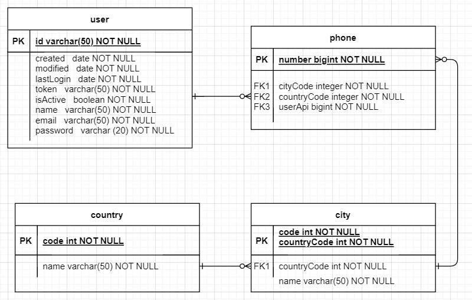
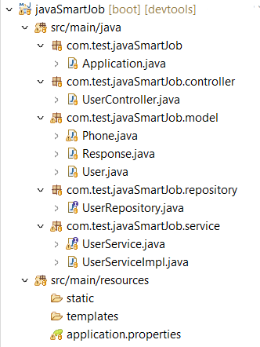

Se entrega la solución del API REST de creación de usuarios, el cual acepta y retorna datos únicamente en formato de JSON.

Inicialmente la base de datos que almacena la información de los usuarios está dada por un diagrama entidad relación como el siguiente: 



El script para crear un ejemplo de esta base de datos, se encuentra en la carpeta docs del repositorio.

Dentro del API se encuentran los respectivos endpoint para realizar las operaciones de @Get, @Post, @Put y @Delete, todas ellas mediante la ruta "/api/user", para cada una de ellas se espera que el cuerpo de la solicitud tenga una estructura como la siguiente:

```json
{
    "name": "Juan Rodriguez",
    "email": "juan@rodriguez.org",
    "password": "hunter2",
    "phones": [
        {
        "number": "1234567",
        "citycode": "1",
        "contrycode": "57"
        }
    ]
}
```

De igual forma la respuesta del servicio será contestada en un formato tipo JSON.

Para la solución se planteó la siguiente estructura de proyecto, donde se observan los paquetes, clases e interfaces debidamente escalonados y a los cuales se puede acceder dentro de las respectivas rutas en este repositorio.



Adjunto a la información anteriormente referenciada también se encuentra dentro del repositorio el POM correspondiente al desarrollo del proyecto, que contiene todas las dependencias necesarias para el correcto funcionamiento de las librerías utilizadas.
